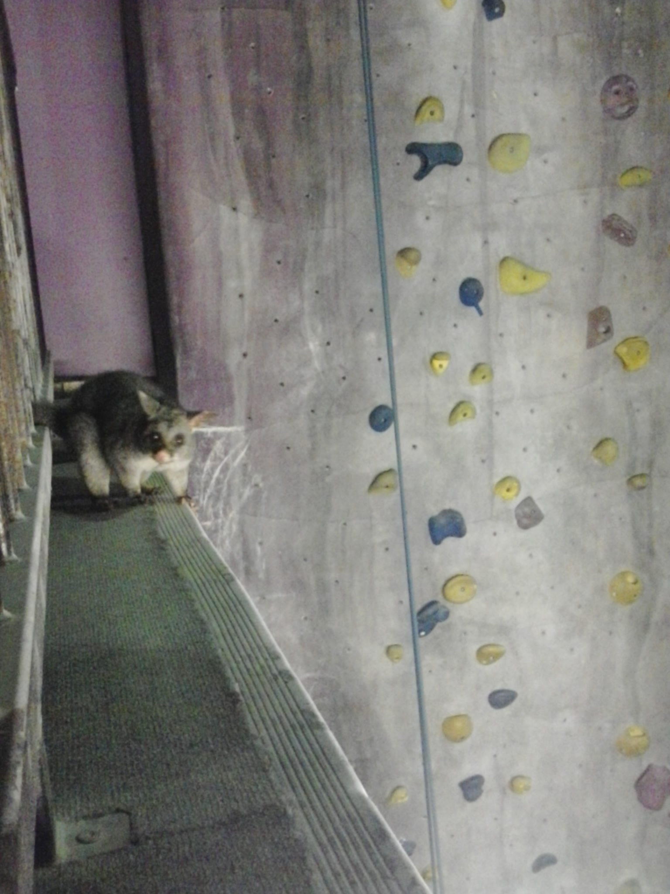
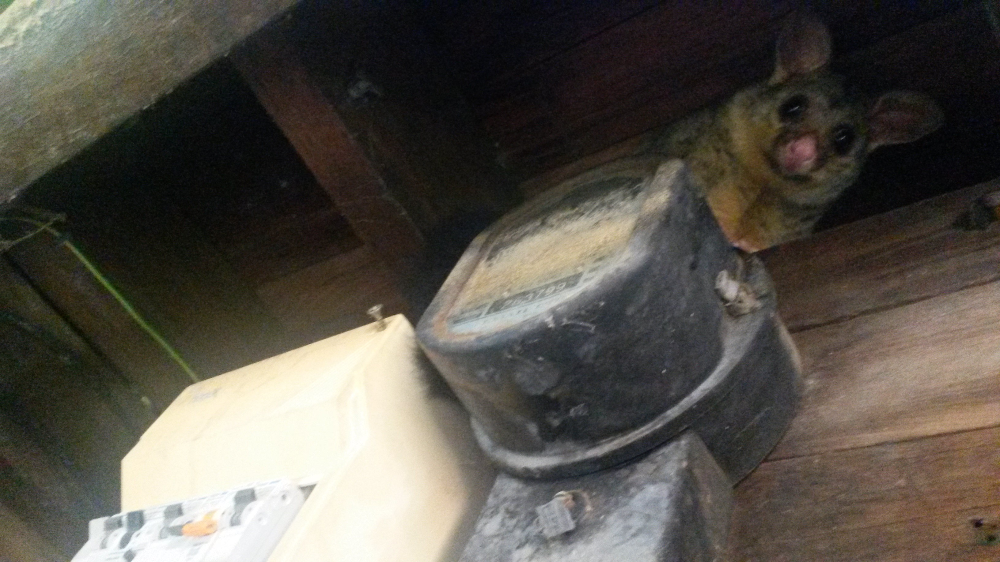
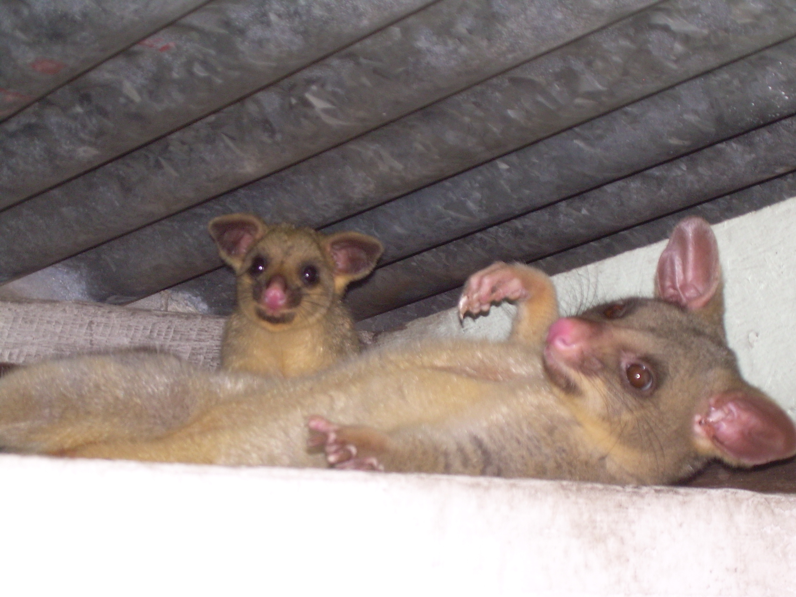

# Building and deploying an image classifer - a case study

In this repo I demonstrate how to quickly build an image classifier by using a pre-trained neural network of a [**ResNet-18**](https://arxiv.org/abs/1512.03385) architecture trained on ImageNet and applying transfer learning to it. I further show how this model can be saved and deployed in a **Rest API** using **Docker**.

## Background
The model can recognize and distinguish between images of the [Australian Common brushtail possum](https://en.wikipedia.org/wiki/Common_brushtail_possum) and the [American Virginia opossum](https://en.wikipedia.org/wiki/Virginia_opossum). I decided to build this classifier as a case study because the two animals have similar physical appearance. Furthermore, the fur colour of the Australian Common brushtail possum ranges from yellow to brown-grey and therefore covers a variety of colours. Based on these characteristics, it might be difficult for a nerual network model to distinguish between the two marsupials. I was interested in how well transfer learning works with a limited number of images (around 140 per species) and a limited number of training epochs (10 in this case) in addition to a pre-trained network.

## Technical details
For downloading the images, loading the data, building the model and making predictions I made use of the [fastai library](https://docs.fast.ai/) which is built on top of PyTorch. The code in the two notebooks (`Get_images_from_Bing.ipynb` and `Possum_vs_opossum_image_classifier.ipynb`) is adapted from the notebook `02_production.ipynb` in fastai's fastbook (see here: https://github.com/fastai/fastbook/blob/master/02_production.ipynb).

I downloaded 150 images of each animal species. After checking if all downloaded files are images and cleaning the data by hand (I removed a few non-correct species images, cartoons and other drawings) I was left with 143 images of the Australian Common brushtail possum and 139 images of the American Virginia opossum. The file sizes ranged from 8.4 KB to 7.4 MB.

I trained the model using a VM instance with a single **GPU** on **Google Cloud Platform** (Machine type: n1-standard-4 (4 vCPUs, 15 GB memory); GPU: NVIDIA Tesla K80).

The virtual environment requirements for running the notebooks are stored in the file `notebook_requirements.txt`.

I deployed the model with a simple Flask app (`deploy/marsupial_predict.py`). The app can be used in combination with Docker by running the following code from the `deploy` folder which contains the required files for building and running the docker container:

```
docker image build -t marsupials .
docker run -p 5001:5000 -d marsupials
```

Images can be sent to the server for example with cURL. An example is given below:

```
curl -i \
    --request POST \
    --header "Content-Type: multipart/form-data" \
    -F "image=@/home/maren/Documents/GitHub/build-and-deploy-image-classifier/images/brushtail_possum2.jpg" \
    localhost:5001
```

## Results
I tested the model with my own images of the Australian Common brushtail possum and a few images of the American Virginia opossum which I downloaded from the internet. 

All training images were close-up photos of the animals. The test images of the Virginia opossum closely matched the training images in terms of "occupied area in the image" and "orientation of the animal in the image". Therefore, variation in these characteristics was rather low in the downloaded test images and all predictions unsurprisingly were correct and of high confidence. In contrast, my own test images of the Common brushtail possum display these animals in all kinds of different sizes and positions (e.g. the possum appears on the side of the image and only covers a small part; the possum is lying on its back). I found that the classifier can also correctly identify all of these images. Below are a few examples.

---

A possum having a blast in a climbing gym in Brisbane.



Prediction: brushtail possum; confidence: 0.61

---

This possum broke into my share house during the night and as a revenge for getting kicked out switched off the hot water and part of the electricity the next day. (Don't mess with Australian wildlife!)



Prediction: brushtail possum; confidence: 1.00

---

Mom and baby possum under the roof.



Prediction: brushtail possum; confidence: 1.00

---

## Conclusion

In summary, the transfer learning worked very well. Even though I built the classifier with a comparatively small number of training images and even though I added only 10 training epochs to the pre-trained model, no mis-classification occurred in the validation set and the test set, which largely consisted of my own images.

The first test image displayed above was correctly classified by the model as a Common brushtail possum, however the confidence is 61.%. This comparatively low confidence is likely due to the possum appearing on the far left of the photo and being of small size. However, given that this image was not mis-classified, indicates a certain robustness of the model.

The third image above displays a possum lying on its back and a baby possum. In the training set there were no images of Common brushtail possums lying on their back, however the model correctly classified this image with a confidence of 100%. This condfidence might be explained with the training set containing an image of a brushtail possum in front of an almost identical background. It is therefore possible that the model's high confidence is partly due to the strong similarities in background colour and pattern.

My experience with the fastai library was very positive. I used this library for the first time for the purpose of exploring it and found it easy to use and understand. It definitely allows for quick model prototyping. I did however not investigate how fastai compares to other deeplearning libraries regarding advanced neural network development (e.g. building your own architectures).

Furthermore, the small Flask app I built is a useful tool for quick testing and proof of concept. However, as stated in the Flask documentation (see reference below), a minimal Flask application such as the one shown here, should not be used in production.

## Outlook
If you like the project and want to check out the possum versus opossum classifier yourself, try with your own images!

## Resources: 
https://course.fast.ai/ <br>
https://www.smashingmagazine.com/2018/01/understanding-using-rest-api/ <br>
https://flask.palletsprojects.com/en/1.1.x/quickstart/#quickstart <br>
https://medium.com/@tasnuva2606/dockerize-flask-app-4998a378a6aa

